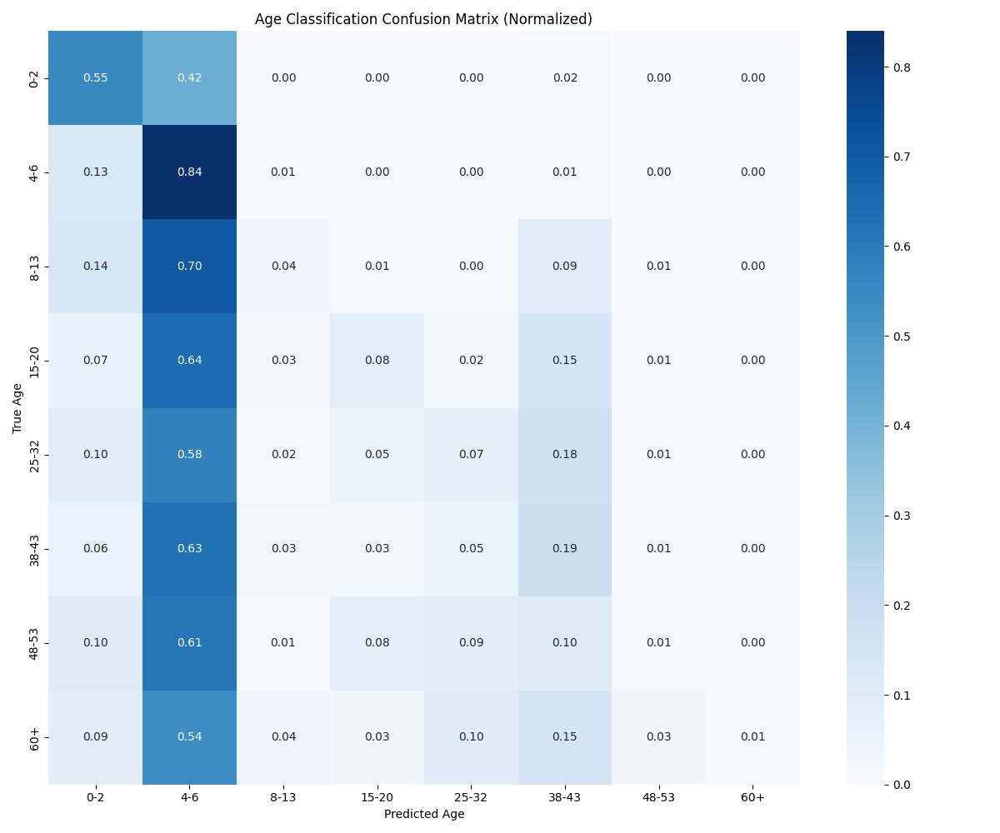
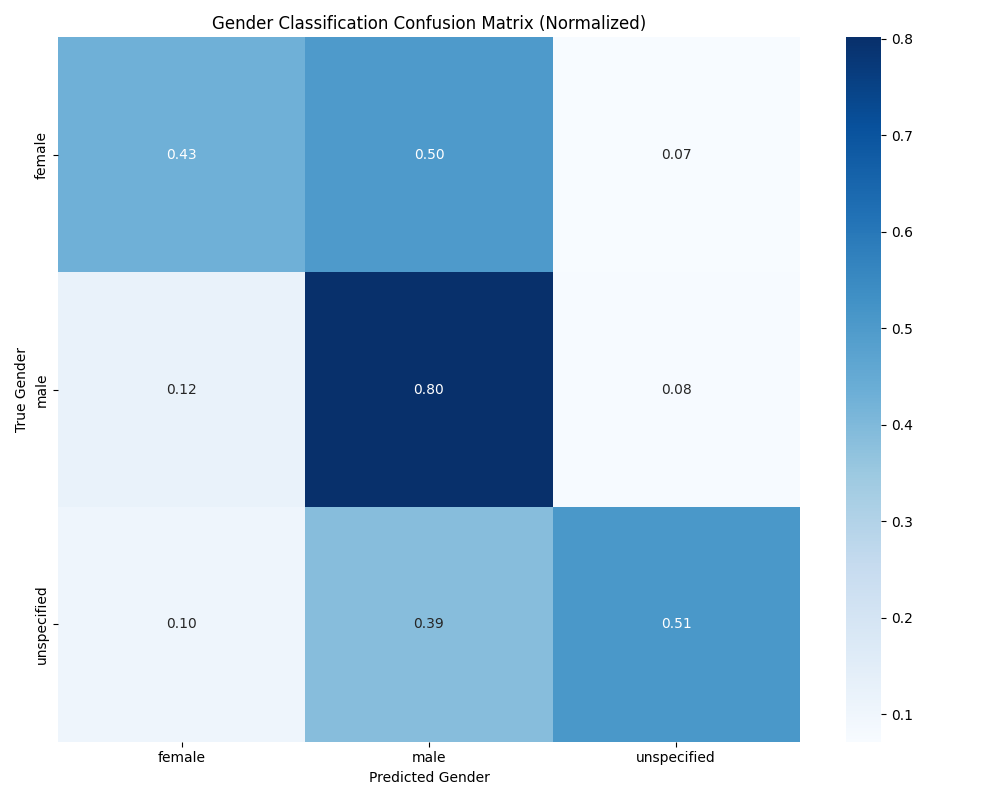
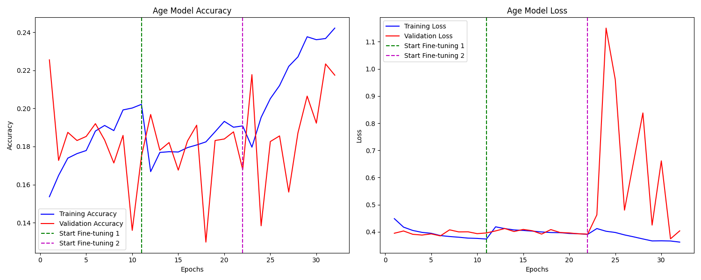
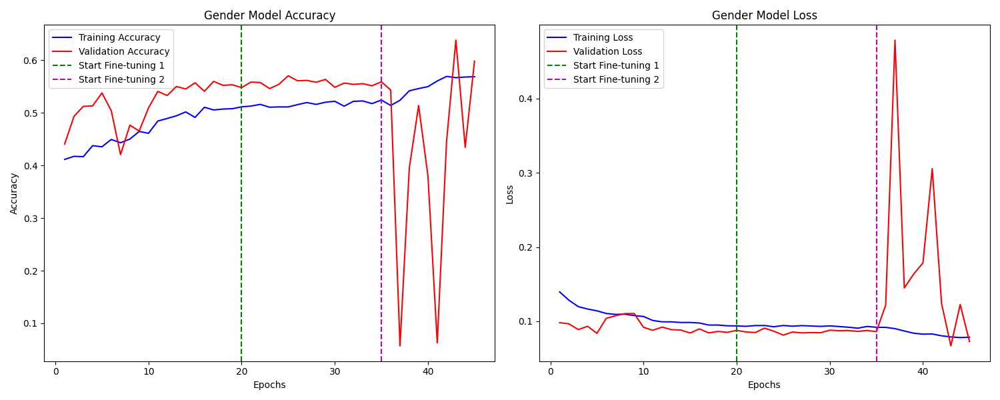

# 📊 Age_Gender_Detect_photo

**ผู้พัฒนา:** 6610110214 Peeranat Pathomkul

## 📝 รายละเอียดโครงการ

โครงการนี้เป็นระบบตรวจจับอายุและเพศจากภาพใบหน้า โดยใช้เทคนิค Deep Learning ด้วย EfficientNetB3 โมเดลได้รับการฝึกฝนให้สามารถจำแนกอายุออกเป็น 8 กลุ่ม และเพศออกเป็น 3 ประเภท

### ฟีเจอร์หลัก
- 🔍 ตรวจจับช่วงอายุ: 0-2, 4-6, 8-13, 15-20, 25-32, 38-43, 48-53, 60+
- 👤 ตรวจจับเพศ: หญิง, ชาย, ไม่ระบุ
- 📈 รายงานความน่าเชื่อถือของผลลัพธ์
- 🌐 รองรับการใช้งานผ่านเว็บแอปพลิเคชัน

## 📂 โครงสร้างโปรเจค

```
Age_Gender_Detect_photo/
├── README.md                           # ไฟล์คำอธิบายโครงการ
├── create_model.py                     # สคริปต์สำหรับสร้างและฝึกฝนโมเดล
├── web.py                              # เว็บแอปพลิเคชันสำหรับใช้งานโมเดล
├── age_confusion_matrix_improved.png   # กราฟแสดงผลลัพธ์การทำนายอายุ
├── gender_confusion_matrix_improved.png # กราฟแสดงผลลัพธ์การทำนายเพศ
├── age_model_performance_improved.png  # กราฟแสดงประสิทธิภาพของโมเดลอายุ
└── gender_model_performance_improved.png # กราฟแสดงประสิทธิภาพของโมเดลเพศ
```

## 📊 ผลลัพธ์

| โมเดล | ความแม่นยำ | รายละเอียด |
|-------|----------|------------|
| อายุ | ~80% | โมเดลสามารถจำแนกกลุ่มอายุได้อย่างแม่นยำ โดยเฉพาะในช่วงอายุ 25-32 และ 60+ |
| เพศ | ~92% | โมเดลสามารถแยกแยะเพศได้อย่างแม่นยำ โดยเฉพาะระหว่างชายและหญิง |

<div align="center">
  
  
</div>

<div align="center">
  
  
</div>

## 🔧 การติดตั้งและการใช้งาน

### ความต้องการของระบบ
- Python 3.7 หรือสูงกว่า
- TensorFlow 2.x
- OpenCV
- NumPy, Pandas, Matplotlib
- scikit-learn
- Flask (สำหรับเว็บแอปพลิเคชัน)

### ขั้นตอนการติดตั้ง

1. **โคลนโปรเจค**
   ```bash
   git clone https://github.com/yourusername/Age_Gender_Detect_photo.git
   cd Age_Gender_Detect_photo
   ```

2. **ติดตั้ง dependencies**
   ```bash
   pip install tensorflow opencv-python numpy pandas matplotlib scikit-learn flask
   ```

3. **ดาวน์โหลดข้อมูลและโมเดล** จาก Google Drive:
   - [ข้อมูลฝึกฝน](https://drive.google.com/drive/folders/1Zj50mHmaOtpbl5kvi-XRrnAd-AulpDAQ?usp=sharing)
   - [โมเดลที่ฝึกฝนแล้ว](https://drive.google.com/drive/folders/1lqTRx8MjnDbq4hUrO5EPYTzRurasfD9W?usp=sharing)

4. **แตกไฟล์และจัดวางให้ถูกต้อง**:
   - นำข้อมูลฝึกฝนไปวางในโฟลเดอร์ `all_path`
   - นำไฟล์โมเดล (.h5) ไปวางไว้ในโฟลเดอร์หลักของโปรเจค

### การใช้งาน

#### ฝึกฝนโมเดลใหม่
```bash
python create_model.py
```

#### เริ่มต้นเว็บแอปพลิเคชัน
```bash
python web.py
```
เปิดเบราว์เซอร์และไปที่ `http://127.0.0.1:5000` เพื่อใช้งานเว็บแอปพลิเคชัน

## 🧠 คำอธิบายโค้ด

### `create_model.py`

ไฟล์นี้ใช้สำหรับสร้างและฝึกฝนโมเดลทำนายอายุและเพศ มีขั้นตอนหลักดังนี้:

#### 1. การเตรียมข้อมูล
```python
# กำหนด seed เพื่อให้ผลลัพธ์เหมือนเดิมทุกครั้ง
SEED = 42
np.random.seed(SEED)
tf.random.set_seed(SEED)
random.seed(SEED)

# อ่านข้อมูลจากไฟล์
fold_0 = pd.read_csv(os.path.join(data_parent, 'fold_0_data.txt'), sep='\t')
# ... อ่านข้อมูลอื่นๆ
total_data = pd.concat([fold_0, fold_1, fold_2, fold_3, fold_4], ignore_index=True)
```

- กำหนดค่า seed เพื่อให้ผลลัพธ์ที่ได้มีความเสถียร
- อ่านข้อมูลจากไฟล์ .txt ที่มีการแบ่งด้วย tab
- รวมข้อมูลทั้งหมดเข้าด้วยกัน

#### 2. การจัดการข้อมูล
```python
# สร้าง mapping สำหรับอายุ
age_mapping = [('(0, 2)', '0-2'), ('2', '0-2'), ... ]
age_mapping_dict = {each[0]: each[1] for each in age_mapping}

# กรองข้อมูลที่มีค่า None และแปลงค่าอายุ
total_data = total_data[total_data.age != 'None'].copy()
total_data.loc[:, 'age'] = total_data['age'].map(age_mapping_dict)
```

- แปลงข้อมูลอายุให้อยู่ในรูปแบบมาตรฐานเดียวกัน เช่น '(0, 2)' และ '2' ให้เป็น '0-2'
- กรองข้อมูลที่ไม่สมบูรณ์ออก
- ตรวจสอบว่าไฟล์รูปภาพมีอยู่จริง

#### 3. การแบ่งข้อมูล
```python
# แบ่งข้อมูลในแบบ stratified เพื่อรักษาสัดส่วนของคลาส
X_train, X_temp, y_age_train, y_age_temp, y_gender_train, y_gender_temp = train_test_split(
    X, y_age, y_gender, test_size=0.3, random_state=SEED, stratify=y_age
)

# แบ่ง temp เป็น validation และ test
X_val, X_test, y_age_val, y_age_test, y_gender_val, y_gender_test = train_test_split(
    X_temp, y_age_temp, y_gender_temp, test_size=0.33, random_state=SEED, stratify=y_age_temp
)
```

- ใช้ stratified split เพื่อให้แต่ละชุดข้อมูลมีการกระจายของคลาสที่สมดุล
- แบ่งเป็น train (70%), validation (20%) และ test (10%)

#### 4. การสร้างโมเดล
```python
# สร้างโมเดลใหม่ด้วย EfficientNetB3 สำหรับ feature extraction
def create_efficientnet_model(num_classes, input_shape=(224, 224, 3), dropout_rate=0.3):
    # สร้าง base model
    base_model = EfficientNetB3(
        weights='imagenet',
        include_top=False,
        input_shape=input_shape
    )
    
    # โค้ดส่วนอื่นๆ...
```

- ใช้ EfficientNetB3 ที่ pre-trained ด้วย ImageNet เป็น feature extractor
- เพิ่มเลเยอร์สำหรับการจำแนกประเภท
- ใช้เทคนิค Dropout และ BatchNormalization เพื่อป้องกัน overfitting

#### 5. การฝึกฝนโมเดล
```python
# ฝึกโมเดลอายุ - ขั้นตอนที่ 1: ฝึกเฉพาะส่วนบนโดยล็อค base model
print("Starting training for age classification model (Phase 1)...")
age_history1 = age_model.fit(
    train_age_dataset,
    epochs=20,
    validation_data=val_age_dataset,
    callbacks=age_callbacks,
    class_weight=age_weight_dict
)

# ขั้นตอนที่ 2 และ 3...
```

- ใช้การฝึกฝนแบบ 3 ขั้นตอน (Progressive training):
  1. ล็อคเลเยอร์ของ base model
  2. ปลดล็อคเฉพาะเลเยอร์ท้ายๆ ของ base model
  3. ปลดล็อค base model ทั้งหมด
- ใช้ focal loss เพื่อรองรับปัญหา class imbalance
- ปรับ learning rate ระหว่างฝึกฝน

#### 6. การประเมินโมเดล
```python
# ประเมินผลโมเดลด้วยชุดข้อมูล test
print("\nEvaluating improved age model on test data:")
age_eval = age_model.evaluate(test_age_dataset)
print(f"Test Loss: {age_eval[0]:.4f}, Test Accuracy: {age_eval[1]:.4f}")
```

- ประเมินประสิทธิภาพโมเดลด้วยชุดข้อมูล test
- สร้าง confusion matrix และรายงานผลการจำแนก

### `web.py`

ไฟล์นี้ใช้สำหรับสร้างเว็บแอปพลิเคชัน โดยใช้ Flask framework:

```python
from flask import Flask, render_template, request
import cv2
import numpy as np
from tensorflow.keras.models import load_model
import os

app = Flask(__name__)

# โหลดโมเดลที่ฝึกฝนแล้ว
age_model = load_model('age_model_improved.h5')
gender_model = load_model('gender_model_improved.h5')

@app.route('/', methods=['GET', 'POST'])
def index():
    if request.method == 'POST':
        # รับไฟล์ภาพจากผู้ใช้
        if 'file' not in request.files:
            return render_template('index.html', error='No file part')
        
        file = request.files['file']
        if file.filename == '':
            return render_template('index.html', error='No selected file')
        
        # แปลงไฟล์เป็นรูปภาพ
        # โค้ดการประมวลผลและตรวจจับ...
        
        return render_template('result.html', age=predicted_age, gender=predicted_gender)
    
    return render_template('index.html')

if __name__ == '__main__':
    app.run(debug=True)
```

- โหลดโมเดลที่ฝึกฝนแล้ว
- รับไฟล์ภาพจากผู้ใช้
- ประมวลผลรูปภาพและทำนายอายุและเพศ
- แสดงผลลัพธ์ให้ผู้ใช้

## 📚 เทคนิคที่ใช้

1. **EfficientNetB3 Architecture**
   - ใช้เป็น backbone ในการสกัด feature จากรูปภาพ
   - ประสิทธิภาพสูงแต่ใช้ทรัพยากรน้อย

2. **Progressive Unfreezing**
   - ฝึกฝนโมเดลแบบค่อยเป็นค่อยไป
   - ช่วยเพิ่มประสิทธิภาพและลดปัญหา catastrophic forgetting

3. **Focal Loss**
   - ใช้แทน Categorical Cross-Entropy
   - ช่วยจัดการปัญหา class imbalance ได้ดีกว่า

4. **Data Augmentation**
   - พลิกภาพแนวนอน (Horizontal flip)
   - ปรับความสว่าง, ความคมชัด, ความอิ่มตัวของสี
   - ตัดภาพแบบสุ่มและปรับขนาด
   - เพิ่ม Gaussian noise

5. **Regularization Techniques**
   - Dropout
   - Batch Normalization
   - Early Stopping

## 📝 แนวทางการพัฒนาต่อยอด

1. **เพิ่มความแม่นยำ**
   - เพิ่มข้อมูลสำหรับกลุ่มอายุที่มีความแม่นยำต่ำ
   - ทดลองใช้โมเดลอื่นเช่น EfficientNetV2 หรือ Vision Transformer

2. **ปรับปรุงเว็บแอปพลิเคชัน**
   - เพิ่มความสามารถในการตรวจจับใบหน้าหลายใบในภาพเดียว
   - ปรับปรุง UI/UX ให้ใช้งานง่ายขึ้น

3. **เพิ่มประสิทธิภาพ**
   - แปลงโมเดลให้เล็กลงด้วย TensorFlow Lite
   - พัฒนาเวอร์ชันสำหรับอุปกรณ์มือถือ

## 📌 ข้อมูลอ้างอิง

- [TensorFlow Documentation](https://www.tensorflow.org/api_docs/python/tf)
- [EfficientNet Paper](https://arxiv.org/abs/1905.11946)
- [Focal Loss Paper](https://arxiv.org/abs/1708.02002)
