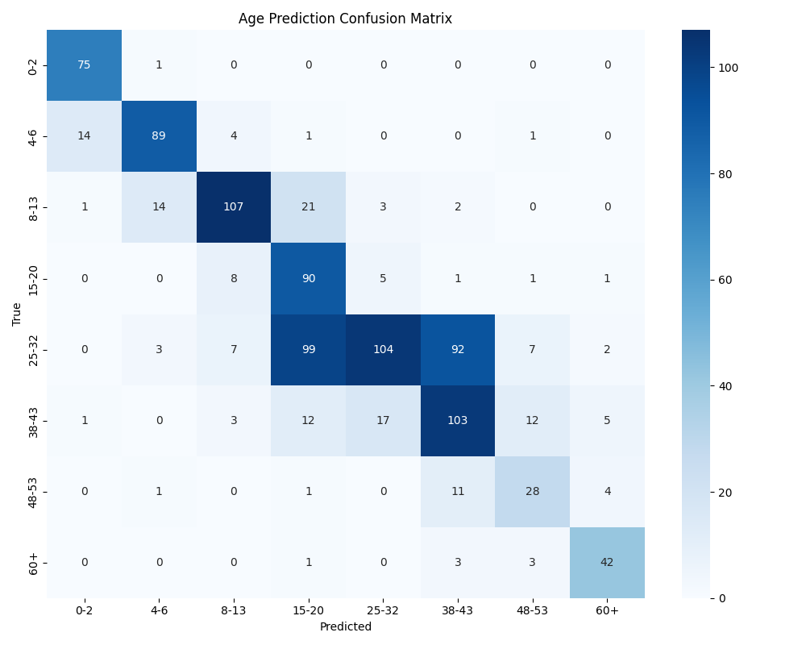
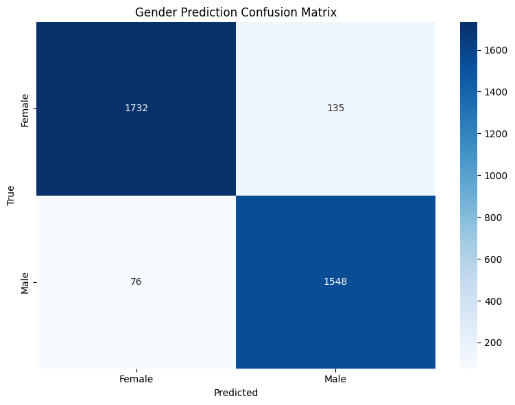
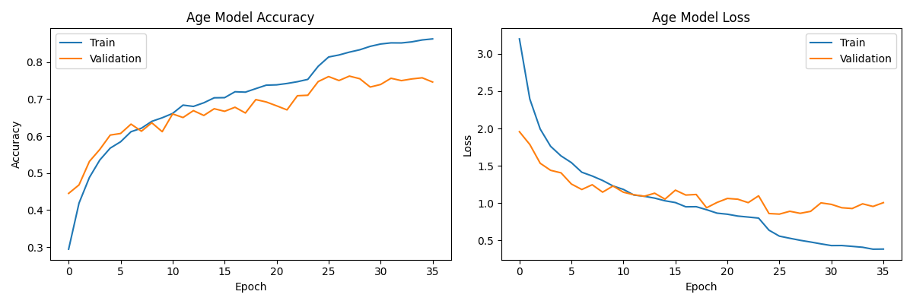
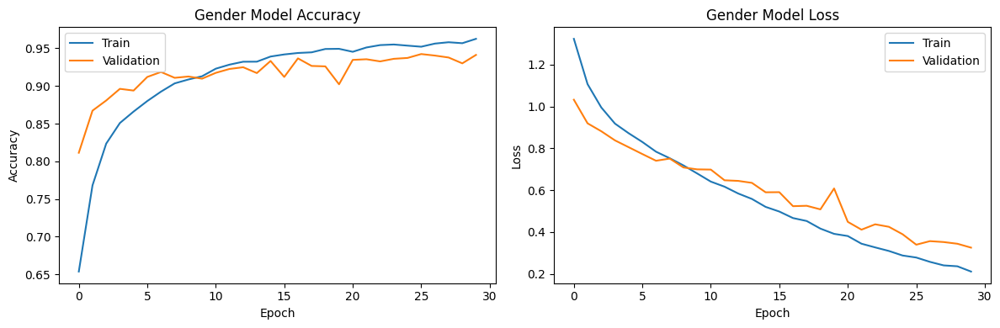

# 📊 Age_Gender_Detect_photo

**ผู้พัฒนา:** 6610110214 Peeranat Pathomkul

## 📝 รายละเอียดโครงการ

โครงการนี้เป็นระบบตรวจจับอายุและเพศจากภาพใบหน้า โดยใช้เทคนิค Deep Learning ด้วย ResNet50V2 ซึ่งเป็นโมเดลที่มีประสิทธิภาพสูงในการวิเคราะห์ภาพ โมเดลได้รับการฝึกฝนให้สามารถจำแนกอายุออกเป็น 8 กลุ่ม ด้วยความแม่นยำ ~75% และเพศออกเป็น 2 ประเภท ด้วยความแม่นยำสูงถึง ~94% จากกราฟการฝึกฝนแสดงให้เห็นว่าโมเดลมีการเรียนรู้ที่ดีโดยไม่เกิดปัญหา overfitting มากเกินไป ช่วยให้สามารถวิเคราะห์ข้อมูลจากภาพใบหน้าได้อย่างมีประสิทธิภาพและแม่นยำสูง

### ฟีเจอร์หลัก
- 🔍 **ตรวจจับช่วงอายุ:** แบ่งเป็น 8 กลุ่ม (0-2, 4-6, 8-13, 15-20, 25-32, 38-43, 48-53, 60+)
- 👤 **ตรวจจับเพศ:** หญิง, ชาย (มีความแม่นยำสูงถึง ~94%)
- 📈 **รายงานความน่าเชื่อถือ:** แสดงค่าความเชื่อมั่นของผลการทำนายเป็นเปอร์เซ็นต์
- 🌐 **เว็บแอปพลิเคชัน:** ใช้งานง่ายผ่านอินเทอร์เฟซเว็บ (รองรับการทำงานแบบ real-time ด้วย fps ที่ดีขึ้น)
- 🔄 **ปรับปรุงคุณภาพภาพอัตโนมัติ:** ใช้ CLAHE และ Histogram Equalization เพื่อเพิ่มประสิทธิภาพ
- 🎦 **รองรับการตรวจจับจากกล้อง:** ใช้ OpenCV สำหรับตรวจจับใบหน้าแบบ real-time

## 📂 โครงสร้างโปรเจค

```
Age_Gender_Detect_photo/
├── README.md                           # ไฟล์คำอธิบายโครงการ
├── web.py                              # เว็บแอปพลิเคชันสำหรับใช้งานโมเดล (ปรับปรุง fps ของกล้อง)
├── age_model.ipynb                     # Jupyter Notebook สำหรับโมเดลทำนายอายุ
├── gender_model.ipynb                  # Jupyter Notebook สำหรับโมเดลทำนายเพศ
├── opencv_face_detector.pbtxt          # ไฟล์คอนฟิกสำหรับตัวตรวจจับใบหน้า OpenCV
├── opencv_face_detector_uint8.pb       # โมเดลตรวจจับใบหน้า OpenCV
├── result_age_model/                   # โฟลเดอร์สำหรับเก็บผลการทดสอบและกราฟของโมเดลอายุ
│   ├── age_confusion_matrix.png        # กราฟแสดง Confusion Matrix ของโมเดลอายุ
│   ├── age_model_training.png          # กราฟแสดงความเชื่อมั่นของการทำนายอายุ
└── result_gender_model/                # โฟลเดอร์สำหรับเก็บผลการทดสอบและกราฟของโมเดลเพศ
    ├── gender_confusion_matrix.png     # กราฟแสดง Confusion Matrix ของโมเดลเพศ
    ├── age_model_training.png        # กราฟแสดงการกระจายตัวของข้อมูลเพศ
```

## 📊 ผลลัพธ์และประสิทธิภาพ

| โมเดล | ความแม่นยำ | รายละเอียด |
|-------|----------|------------|
| อายุ (ResNet50V2) | ~75% | โมเดลสามารถจำแนกกลุ่มอายุได้ดีมากจากกราฟที่แสดงผล โดยมีความแม่นยำสูงถึง 75% ในชุดข้อมูล validation และเกือบ 85% ในชุดข้อมูล training แสดงถึงความสามารถในการเรียนรู้ที่ดีโดยไม่เกิด overfitting มากเกินไป |
| เพศ (ResNet50V2) | ~94% | โมเดลเพศสามารถทำงานได้อย่างมีประสิทธิภาพสูงมาก โดยมีความแม่นยำถึง 94% ในชุดข้อมูล validation และมีความสอดคล้องกับชุดข้อมูล training แสดงให้เห็นถึงความเสถียรของโมเดล |

<div align="center">
  
  
</div>

<div align="center">
  
  
</div>

## 🔧 การติดตั้งและการใช้งาน

### ความต้องการของระบบ
- Python 3.7 หรือสูงกว่า (แนะนำ 3.8)
- TensorFlow 2.x
- OpenCV
- NumPy, Pandas, Matplotlib
- scikit-learn
- Flask (สำหรับเว็บแอปพลิเคชัน)
- Jupyter Notebook (สำหรับการทดลองและปรับปรุงโมเดล)

### ขั้นตอนการติดตั้ง

1. **โคลนโปรเจค**
   ```bash
   git clone https://github.com/PeeranatPathomkul/Age_Gender_Detect_photo.git
   cd Age_Gender_Detect_photo
   ```

2. **ติดตั้ง dependencies**
   ```bash
   pip install streamlit opencv-python numpy tensorflow pillow streamlit-webrtc av
   ```

3. **ดาวน์โหลดข้อมูลและโมเดล** จาก Google Drive:
   - โมเดลที่ฝึกฝนแล้ว :[https://drive.google.com/drive/folders/1Zj50mHmaOtpbl5kvi-XRrnAd-AulpDAQ?usp=sharing](https://storage.psu.ac.th/drive/d/s/14kLSOqef8e8gANfew6BATQVUZgcBgQx/tjBccQVgJooNZ1HnZNUQE9ya9M4uKaBx-xT4GCt4digw))
   - [ข้อมูลฝึกฝน](https://drive.google.com/drive/folders/1lqTRx8MjnDbq4hUrO5EPYTzRurasfD9W?usp=sharing)


### ⚠️ หมายเหตุสำคัญ

**โปรดตรวจสอบให้แน่ใจว่าได้ดาวน์โหลดและติดตั้งไฟล์ทั้งหมดที่จำเป็นก่อนที่จะรันเว็บแอปพลิเคชัน** เนื่องจากเว็บแอปพลิเคชันต้องโหลดไฟล์เหล่านี้เพื่อทำการทำนาย:

- `models/age_model_best.h5` - โมเดล ResNet50V2 สำหรับทำนายอายุ
- `models/gender_model_best.h5` - โมเดล ResNet50V2 สำหรับทำนายเพศ
- `opencv_face_detector.pbtxt` - ไฟล์คอนฟิกสำหรับตัวตรวจจับใบหน้า
- `opencv_face_detector_uint8.pb` - โมเดลตรวจจับใบหน้า

หากไม่มีไฟล์เหล่านี้ เว็บแอปพลิเคชันจะไม่สามารถทำงานได้อย่างถูกต้องและจะเกิดข้อผิดพลาด

### การใช้งาน

#### การฝึกฝนโมเดล
สำหรับการฝึกฝนโมเดลใหม่หรือทดลองปรับเปลี่ยนพารามิเตอร์ เราใช้ Jupyter Notebook:
```bash
# สำหรับทำนายอายุ
jupyter notebook age_model.ipynb

# สำหรับทำนายเพศ
jupyter notebook gender_model.ipynb
```

#### เริ่มต้นเว็บแอปพลิเคชัน ใช้ py 3.7-3.9 เท่านั้น
```bash
py -m streamlit run web.py
```
เปิดเบราว์เซอร์และไปที่ `http://127.0.0.1:5000` เพื่อใช้งานเว็บแอปพลิเคชัน

หมายเหตุ: เวอร์ชั่นล่าสุดของ web.py มีการปรับปรุงให้มี frame rate (fps) ของกล้องที่ดีขึ้น ทำให้การทำนายแบบ real-time มีความลื่นไหลมากขึ้น

## 🧠 รายละเอียดทางเทคนิค

### การเตรียมข้อมูล
- **แหล่งข้อมูล:** ชุดข้อมูลใบหน้าพร้อมป้ายกำกับอายุและเพศ
- **การแบ่งข้อมูล:** Train (80%), Test (20%) ด้วยเทคนิค Stratified Split
- **การเพิ่มข้อมูล (Data Augmentation):**
  - พลิกภาพแนวนอน (Horizontal flip)
  - ปรับความสว่างและคอนทราสต์ (ปรับช่วงกว้างขึ้น)
  - การหมุนภาพ (±20° สำหรับโมเดลอายุ และ ±25° สำหรับโมเดลเพศ)
  - การเลื่อนภาพ (Translation)
  - เพิ่ม Gaussian noise และ Salt-and-pepper noise
  - Cutout (สร้างพื้นที่สุ่มให้เป็นสีดำหรือสีเฉลี่ย)
  - Zoom in/out (เฉพาะโมเดลเพศ)

### สถาปัตยกรรมโมเดล
#### โมเดลอายุ
- **Backbone:** ResNet50V2 (pre-trained ด้วย ImageNet)
- **Input Size:** 144x144x3 pixels
- **การปรับปรุงภาพ:** CLAHE (Contrast Limited Adaptive Histogram Equalization)
- **การจัดการ Class Imbalance:** Class weights with Boosting (เพิ่มน้ำหนักให้กลุ่มอายุที่ยาก)
- **การป้องกัน Overfitting:** L1/L2 Regularization, Dropout (0.4), Batch Normalization, Early Stopping
- **Learning Rate:** เริ่มต้นที่ 0.0002 พร้อม ReduceLROnPlateau

#### โมเดลเพศ
- **Backbone:** ResNet50V2 (pre-trained ด้วย ImageNet)
- **Input Size:** 128x128x3 pixels
- **การปรับปรุงภาพ:** Histogram Equalization
- **การจัดการ Class Imbalance:** Class weights
- **การป้องกัน Overfitting:** L2 Regularization, Dropout (0.4-0.5), Batch Normalization, Early Stopping
- **Learning Rate:** เริ่มต้นที่ 0.00005 พร้อม weight decay และ ReduceLROnPlateau

## 📚 เทคนิคที่ใช้

1. **ResNet50V2 Architecture**
   - ใช้เป็น backbone ในการสกัด feature จากรูปภาพแทน EfficientNetB3
   - มีประสิทธิภาพสูงสำหรับการรู้จำใบหน้าและการจำแนกคุณลักษณะ
   - มีการเชื่อมต่อแบบ skip connection ที่ช่วยลดปัญหา vanishing gradient

2. **เทคนิคการเพิ่มประสิทธิภาพการเรียนรู้**
   - **Partial Freezing:** ล็อคเฉพาะ 50 เลเยอร์แรกของ ResNet50V2 สำหรับโมเดลอายุ
   - **Selective Layer Freezing:** ล็อคเฉพาะเลเยอร์ต้นๆ เพื่อรักษาฟีเจอร์พื้นฐาน แต่ปล่อยให้เลเยอร์ท้ายๆ เรียนรู้ได้
   - **ReduceLROnPlateau:** ปรับลด learning rate อัตโนมัติเมื่อโมเดลไม่มีการพัฒนา
   - **Class Weighting with Boosting:** เพิ่มน้ำหนักให้กับคลาสที่ยากต่อการทำนาย (อายุกลุ่ม 48-53 และ 60+)

3. **เทคนิคการปรับปรุงภาพขั้นสูง**
   - **CLAHE:** ปรับปรุงคอนทราสต์ของภาพแบบ adaptive สำหรับโมเดลอายุ
   - **Histogram Equalization:** ปรับความสว่างของภาพให้สมดุลสำหรับโมเดลเพศ
   - **Multiple Augmentation:** ใช้หลายเทคนิคร่วมกันเพื่อเพิ่มความหลากหลายของข้อมูล
   - **Cutout Technique:** สร้างพื้นที่สุ่มให้เป็นสีดำหรือสีเฉลี่ยเพื่อเพิ่มความทนทานต่อการบดบังบางส่วน

4. **การป้องกัน Overfitting ขั้นสูง**
   - **L1/L2 Regularization:** ใช้ร่วมกันสำหรับโมเดลอายุ, L2 สำหรับโมเดลเพศ
   - **Balanced Batch Generation:** สร้าง batch แบบสมดุลเพื่อให้โมเดลเรียนรู้ได้ดีขึ้น
   - **Optimal Dropout Rates:** ใช้อัตรา dropout ที่เหมาะสม (0.4-0.5) เพื่อป้องกัน overfitting
   - **Strategic Early Stopping:** ตรวจสอบ val_loss สำหรับโมเดลอายุ และ val_accuracy สำหรับโมเดลเพศ

5. **เทคนิคการเพิ่มประสิทธิภาพเวลาทำนาย**
   - **Enhanced Face Detection:** ใช้ OpenCV สำหรับการตรวจจับใบหน้า
   - **Image Enhancement Before Prediction:** ปรับปรุงภาพก่อนการทำนายด้วย CLAHE
   - **Confidence Reporting:** แสดงค่าความเชื่อมั่นของการทำนายเป็นเปอร์เซ็นต์
   - **Improved FPS:** ปรับปรุง frame rate ของกล้องเพื่อการทำงานแบบ real-time ที่ลื่นไหลมากขึ้น

## 📝 แนวทางการพัฒนาต่อยอด

1. **เพิ่มความแม่นยำ**
   - เพิ่มข้อมูลสำหรับกลุ่มอายุที่มีความแม่นยำต่ำ (โดยเฉพาะกลุ่ม 48-53 และ 60+)
   - ทดลองใช้โมเดลอื่น เช่น Vision Transformer หรือ EfficientNetV2
   - ใช้เทคนิค Ensemble learning รวมผลลัพธ์จากหลายโมเดล
   - ทดลองใช้เทคนิค MixUp และ CutMix เพิ่มเติมเพื่อสร้างข้อมูลสังเคราะห์
   - ใช้ Progressive Resolution Training เริ่มฝึกจากความละเอียดต่ำไปหาสูง

2. **ปรับปรุงเว็บแอปพลิเคชัน**
   - พัฒนาระบบตรวจจับใบหน้าที่ดีกว่า Haar Cascade (เช่น MTCNN หรือ RetinaFace)
   - ปรับปรุง UI/UX ให้ใช้งานง่ายขึ้น
   - เพิ่มความสามารถในการวิเคราะห์วิดีโอแบบ real-time
   - เพิ่มการรายงานผลเชิงสถิติและการวิเคราะห์แนวโน้ม
   - สร้างระบบการให้คำแนะนำตามผลการวิเคราะห์

3. **เพิ่มประสิทธิภาพ**
   - แปลงโมเดลให้เล็กลงด้วย TensorFlow Lite หรือ ONNX
   - ใช้เทคนิค Knowledge Distillation ถ่ายทอดความรู้จากโมเดลใหญ่ไปยังโมเดลเล็ก
   - ใช้ Pruning และ Quantization เพื่อลดขนาดโมเดล
   - ปรับใช้ GPU/TPU เพื่อเพิ่มความเร็วในการทำนาย
   - ทดลองใช้ ONNX Runtime หรือ TensorRT เพื่อเร่งความเร็วในการประมวลผล

4. **เพิ่มฟีเจอร์ใหม่**
   - ตรวจจับอารมณ์จากใบหน้า (สุข, เศร้า, โกรธ, กลัว, ประหลาดใจ ฯลฯ)
   - วิเคราะห์ลักษณะทางกายภาพอื่นๆ เช่น ทรงผม หนวดเครา แว่นตา
   - พัฒนาโมดูลประเมินสุขภาพผิวหรือความเหนื่อยล้าจากใบหน้า
   - เพิ่มฟีเจอร์ความเป็นส่วนตัว เช่น ตัวเลือกการเบลอใบหน้าหลังการวิเคราะห์

## 🔄 การติดตามและแก้ไขปัญหา

หากพบปัญหาหรือต้องการแนะนำการปรับปรุงโครงการ สามารถสร้าง Issue ได้ที่ GitHub Repository หรือติดต่อผู้พัฒนาโดยตรง

## 📌 ข้อมูลอ้างอิง

- [TensorFlow Documentation](https://www.tensorflow.org/api_docs/python/tf)
- [ResNet Paper](https://arxiv.org/abs/1512.03385) - He, K., Zhang, X., Ren, S., & Sun, J. (2016). Deep Residual Learning for Image Recognition.
- [ResNetV2 Paper](https://arxiv.org/abs/1603.05027) - He, K., Zhang, X., Ren, S., & Sun, J. (2016). Identity Mappings in Deep Residual Networks.
- [CLAHE Algorithm](https://docs.opencv.org/master/d5/daf/tutorial_py_histogram_equalization.html) - เทคนิคการปรับปรุงคอนทราสต์ของภาพ
- [Class Imbalance](https://doi.org/10.1007/s13748-018-00160-2) - Johnson, J.M., Khoshgoftaar, T.M. (2019). Survey on Deep Learning with Class Imbalance.
- [Flask Documentation](https://flask.palletsprojects.com/) - สำหรับการพัฒนาเว็บแอปพลิเคชัน
- [OpenCV Documentation](https://docs.opencv.org/) - สำหรับการประมวลผลภาพและตรวจจับใบหน้า
